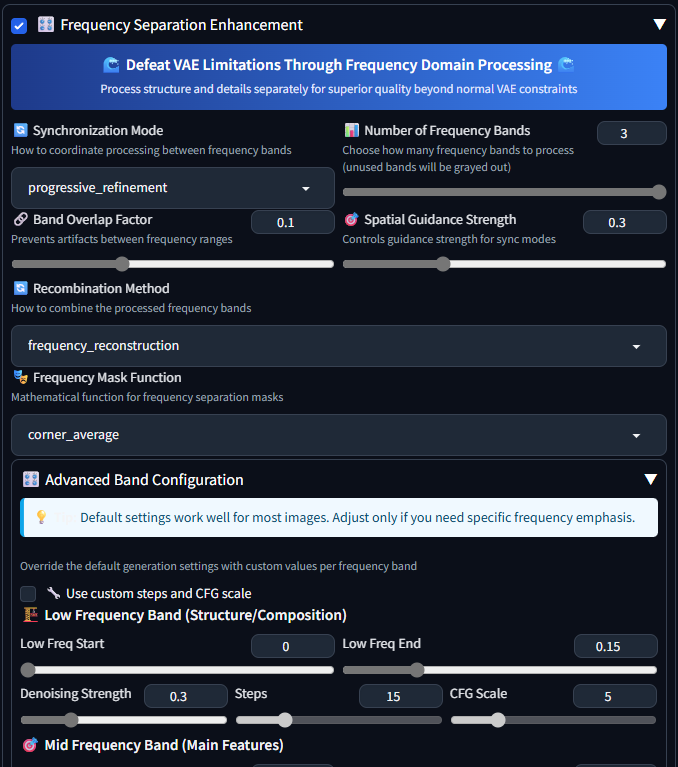

# 🌊 Frequency Separation Extension for WebUI
*Unlock extra-sharp Stable Diffusion renders by processing low, mid & high frequencies separately*

## User Interface

---

## WARNING: This extension is currently experimental and may undergo major changes

## 1. Why You’d Want This  
**Motivation**  
Stable Diffusion’s VAE often softens tiny textures (skin pores, fabric weave, micro-contrast).  
This extension slices every picture into **three “layers” of detail** (structure, features, fine grain), runs each layer through its own diffusion pass, then glues them back together. 
This does not actually work in the predictable way -- most of the image is actually encoded in the highest latent frequencies, the the lower frequencies contribute almost nothing to the final result. In fact, filtering them out can alone produce more detailed images. 

**Technical detail**  
* We work in the Fourier domain. 

* Three radial masks select normalized bands  
* Soft sigmoids with default 10 % overlap.
* Each band is inverse-FFT’d, diffused with custom steps/CFG, then re-FFT’d and merged.
---

## 2. Installation  
**Plain-English steps**  
1. `git clone` this repo in your WebUI `extensions/` or in **Extensions** tab "Install from URL": `https://github.com/thavocado/sd-webui-frequency-separation`
2. Restart the WebUI—look for the **“Frequency Separation”** accordion in *txt2img* & *img2img*.

**Tested Compatibility**
- **Forge**: f2.0.1v1.10.1-previous-665-gae278f79
- **AUTOMATIC1111**: v1.9.4
- **reForge**: f1.7.0-v1.10.1RC-latest-2255-g2b54f24a

## 3. Internal Pipeline

| Stage                  | Description  | Details                                                                                          |
| ---------------------- | ------------------------------------------------------------------------------- | ------------------------------------------------------------------------------------------------------- |
| **FFT Split**          | Turn picture into a “heat-map of squiggles” and carve out low, mid, high zones like an audio EQ. | 2-D FFT, optional `fftshift`, radial / corner masks, DC preservation.                                   |
| **Per-Band Diffusion** | Each layer runs through SD with its own noise, CFG & steps.                 | Dynamically spawns `StableDiffusionProcessingImg2Img`; inherits prompt/seed; band-specific overrides.   |
| **Synchronization**    | Prevents ghosting between layers.                                               | Modes: independent, shared-noise, cross-attention, progressive, shared-latent.                          |
| **Reconstruction**     | Sharpened layers are re-stacked.                                                | Weighted spectrum merge or simple alpha blend → `ifft2`.                                                |
| **Batch Hook**         | Makes sure this all runs before ADetailer.                                  | `postprocess_batch` mutates the tensor batch in-place, so downstream scripts receive the enhanced data. |

---

## 4. Synchronization Modes

Controls how different frequency bands interact during processing. **Independent** and **Shared Latent** are recommended for most use cases.

| Mode | Description | Use Case |
| --- | --- | --- |
| **Independent** ✅ | Each frequency band processes completely independently | Best for maximum detail enhancement and sharpness |
| **Shared Latent** ✅ | Blends latents between bands using spatial guidance strength | Good balance between coherence and detail |
| Synchronized Noise | Uses same random seed across all bands | Experimental - may reduce variety |
| Cross-Attention | Low frequencies guide higher frequency generation | Experimental - limited effectiveness |
| Progressive | Each band builds on the previous one sequentially | Experimental - can accumulate artifacts |

**Spatial Guidance Strength** (0.0-1.0): Controls blending strength for Shared Latent mode. Higher values = more coherence between bands.

---

## 5. Frequency Mask Functions

The extension offers various mathematical distance functions for creating frequency masks. **no_mask** often produces the best results by preserving the original image while adding detail enhancement.

| Function | Description |
| --- | --- |
| **no_mask** ✅ | No frequency separation - processes entire spectrum per band. Often gives best results |
| corner_average | Average distance to all corners (traditional default) |
| center_circular | Simple radial distance from center |
| corner_min_diamond | Minimum distance to any corner |
| corner_rms | Root mean square distance to corners |
| corner_harmonic | Harmonic mean distance to corners |
| corner_product | Product of normalized corner distances |
| transformed_circular | Circular mask with wraparound |
| manhattan | L1 norm distance |
| chebyshev | L∞ norm distance |
| minkowski_1_5 | Minkowski distance with p=1.5 |
| gravitational | Gravitational potential from corners |
| wave_interference | Wave interference from corner sources |

**Note:** Most experimental functions are included for research purposes. 

---

## 6. Advanced Band Configuration

Control each frequency band's processing independently for fine-tuned results.

- **Custom Steps & CFG** (optional): Enable "Use custom steps and CFG scale" to override global settings per band
  - Otherwise uses the main generation settings
- **Brightness Scale** (0.5-2.0): Adjusts the overall brightness and contrast of the recombined image
  - Default 1.0 preserves original brightness
  - Higher values increase brightness and saturation
  - Useful for compensating VAE decoder characteristics

---

## 7. Caveats

* Increases generation time by ~3x due to multiple diffusion passes
* Best used after establishing a base generation you're happy with
* No ComfyUI nodes (yet)
* Synchronization modes other than Independent and Shared Latent are experimental
* Some frequency mask functions are included for research purposes but may not improve results
